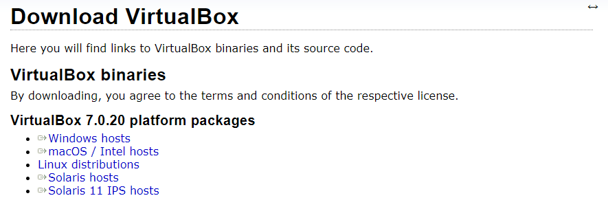

# Práctico 1: Creación de ambiente de trabajo

## 1. Instalación de máquina virtual Kali Linux en VirtualBox

Ir a la página de [Virtual Box](https://www.virtualbox.org/wiki/Downloads) y descargar según el sistema operativo que tengamos.

