# Práctico 1: Creación de ambiente de trabajo

## 1. Instalación de máquina virtual Kali Linux en VirtualBox

Ir a la página de [Virtual Box](https://www.virtualbox.org/wiki/Downloads) y descargar la aplicación según el sistema operativo que tengamos.


Para este ejemplo, realizaremos la instalación en una máquina con Windows.


Hacemos clic en __Next__ hasta finalizar con la instalación.


Luego de instalar Virtual Box, vamos a la página de imágenes de [Kali Linux](https://www.kali.org/get-kali/#kali-installer-images) y descargamos el archivo .iso que nos permitirá crear la máquina virtual en Virtual Box.


Luego, en Virtual Box hacemos clic en __Nueva__ para crear la máquina virtual. En __Imagen ISO__, seleccionamos el archivo .iso que descargamos.

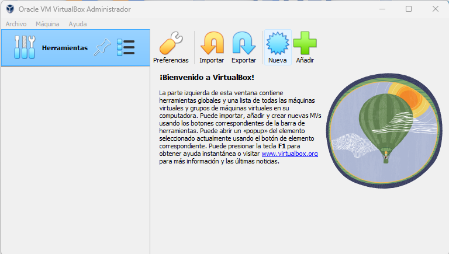

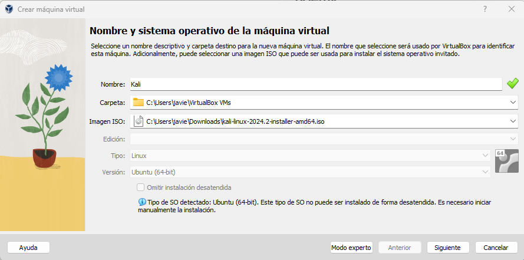

Asignamos los recursos que necesitemos hasta finalizar con la creación.

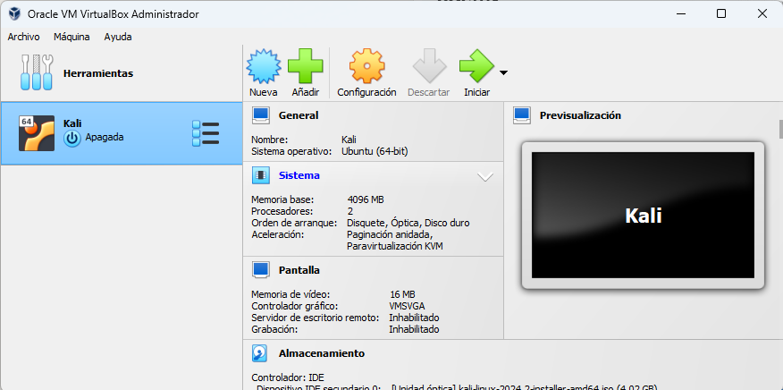

Iniciamos la máquina virtual y realizar la instalación.

## 2. Instalación de un proxy de interceptación (ZAP)

Para poder visualizar el tráfico, será necesario instalar un proxy de interceptación en la máquina virtual. En este ejemplo, instalaremos ZAP. Para ello, abrimos la terminar y ejecutamos el siguiente comando:

`sudo apt install zaproxy -y`

Se nos solicita ingresar la contraseña que configuramos cuando creamos el usuario:

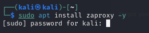 

Luego, la aplicación estara disponible para iniciar.

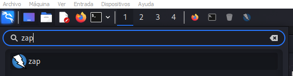

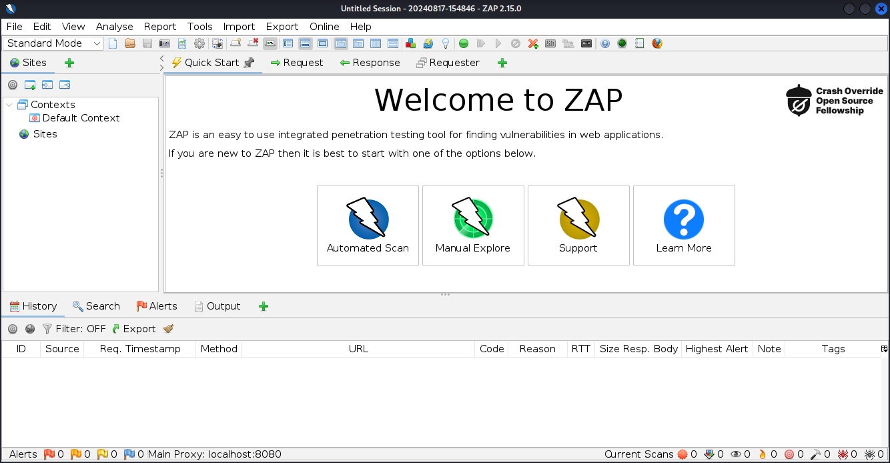

## 3. Instalación de Docker en la máquina virtual de Kali5 Linux

Debermos instalar Dockerar para ejecutar un contener con la aplicación OWASP Juice Shop6 sobre la cual estaremos interceptando el tráfico. Para instalar Docker ejecutamos el siguiente comando en la terminal de la máquina virtual.

`sudo apt install docker.io`

A continuarción, ejecutamos los siguientes comandos para iniciar Docker sin ser usuario root.

```
1. sudo usermod -aG docker ${USER}
2. su - ${USER}
3. sudo usermod -aG docker TU-USUARIO // reemplazar TU-USUARIO por el nombre del usuario que estamos usando
```

## 4. Ejecución de un contenedor con OWASP Juice Shop6

Para instalar la imágen de la aplicación OWASP Juice Shop6, ejecutamos el comando:

`docker pull bkimminich/juice-shop`

Luego, para correr la aplicación de manera local en el puerto 3000, ejecutamos el comando:

`docker run -d -p 3000:3000 bkimminich/juice-shop`

Después de esto, abrimos el navegador y nos dirigimos a la dirección __127.0.0.1:3000__ para visualizar la aplicación.

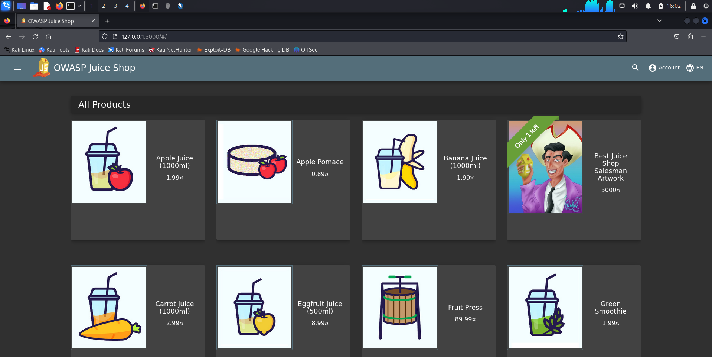

## 5. Prueba de la visualización del tráfico en el proxy de interceptación seleccionado

Para visualizar el tráfico, abrimos ZAP y seleccionamos la opción __Manual Explore__.


Ingresamos la dirección y el puerto en donde está levanta la aplicación de OWASP Juice Shop6. En nuestro caso es la dirección __127.0.0.1:3000__. Seleccionamos el browser que queremos utilizar para explorar la aplicación y hacemos clic en __Launch Browser__.

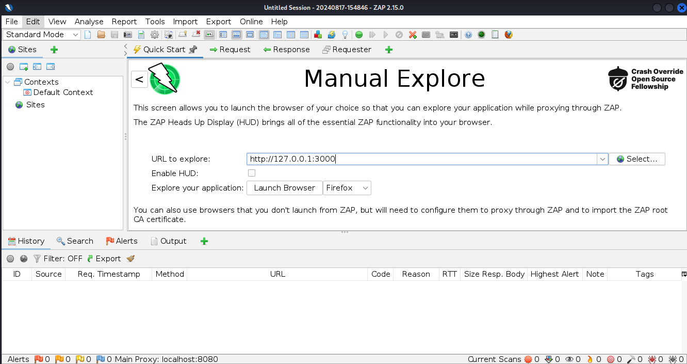

Luego de esto, se abrirá el navegador y podremos interceptar los paquetes desde ZAP cada vez que realizamos una acción desde el navegador.

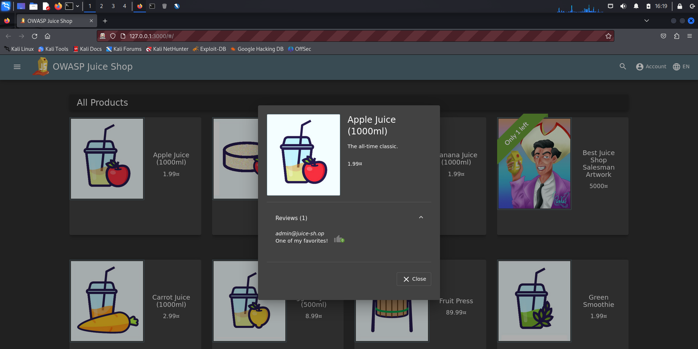

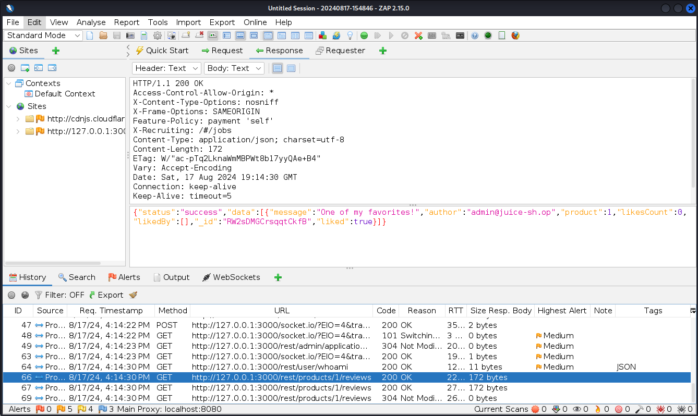

Desde ZAP, también podemos configurar un breakpoint entre todas las solicitudes y respuestas. 

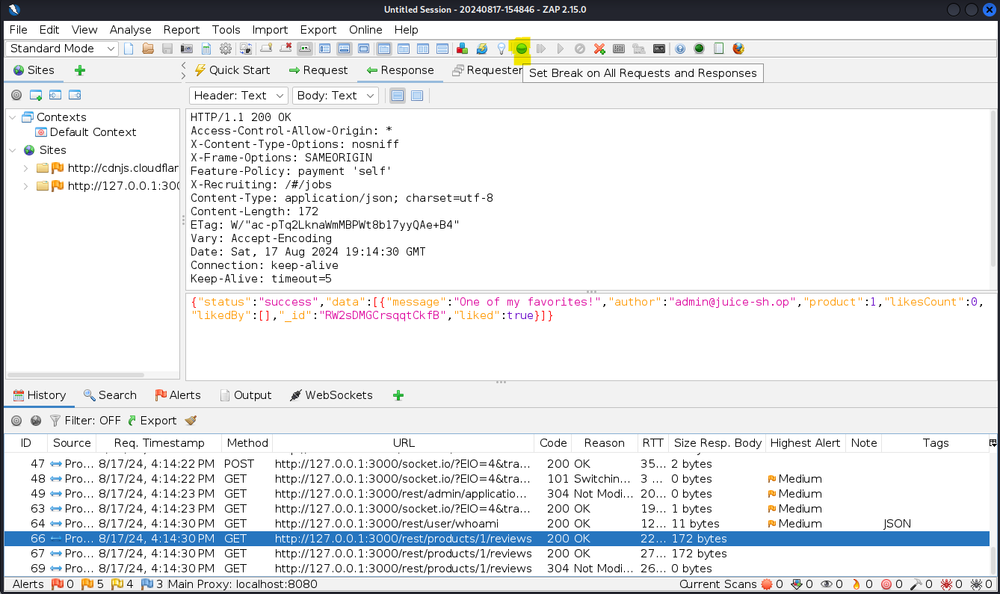

De esta manera, cada vez que se realiza una acción, podemos visualizar los paquetes que se envían uno por uno y modificar la información que contienen.

Por ejemplo, al intentar iniciar sesión podemos modificar tanto las credenciales que se envian, como el mensaje que se devuelve al intentar iniciar sesión de manera incorrecta.

En este caso, modifico la password que se mandó desde la aplicación.

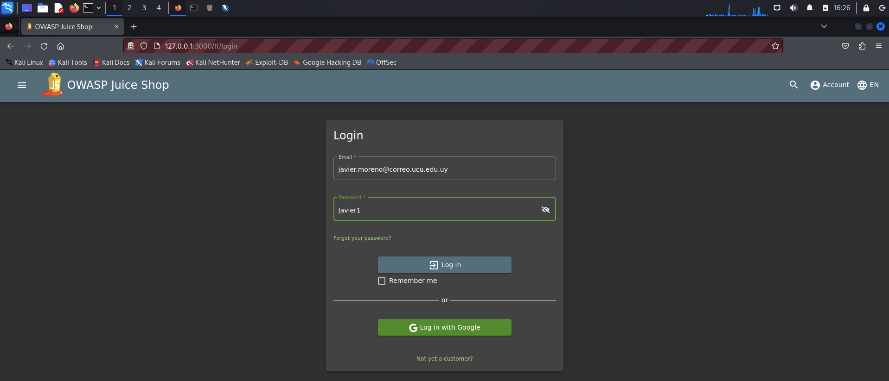


De la misma manera, también puedo modificar la respuesta que se recibe al ingresar una contraseña incorrecta.

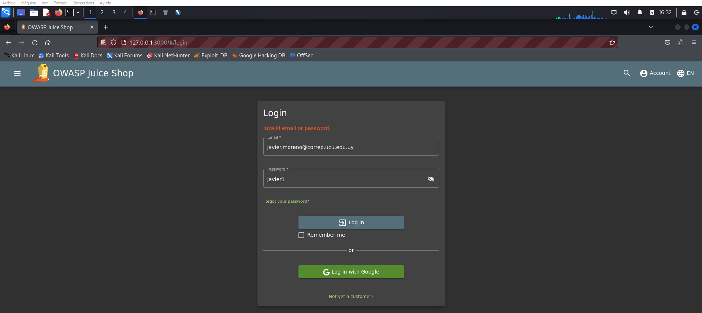

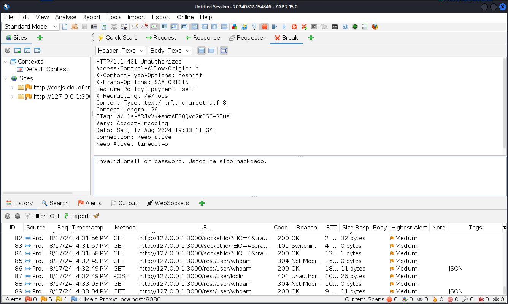

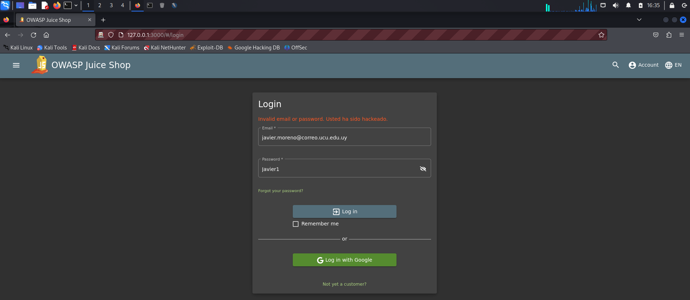
