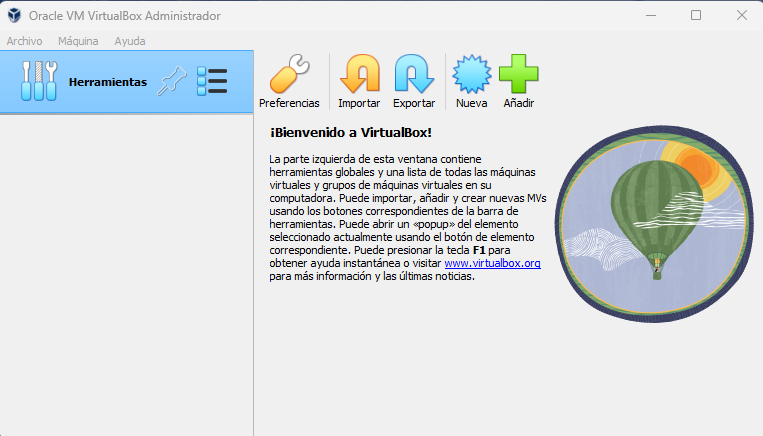
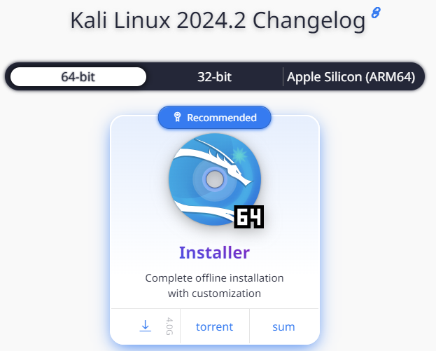

# Práctico 1: Creación de ambiente de trabajo

## 1. Instalación de máquina virtual Kali Linux en VirtualBox

Ir a la página de [Virtual Box](https://www.virtualbox.org/wiki/Downloads) y descargar la aplicación según el sistema operativo que tengamos.

Para este ejemplo, realizaremos la instalación en una máquina con Windows.

Hacemos clic en __Next__ hasta finalizar con la instalación.

Luego de instalar Virtual Box, vamos a la página de máquinas virtuales de [Kali Linux](https://www.kali.org/get-kali/#kali-virtual-machines) y descargamos la imágen para crear la máquina virtual en Virtual Box.

Extraemos el archivo en el zip descargado.

Luego, en Virtual Box hacemos clic en __Nueva__ para crear la máquina virtual. En __Imagen ISO__, seleccionamos el archivo que extraímos del zip.

## 2. Instalación (si es necesario) de un proxy de interceptación (ZAP3 o BURP4)
## 3. Instalación de Docker en la máquina virtual de Kali5 Linux
## 4. Ejecución de un contenedor con OWASP Juice Shop6
## 5. Prueba de la visualización del tráfico en el proxy de interceptación seleccionado
